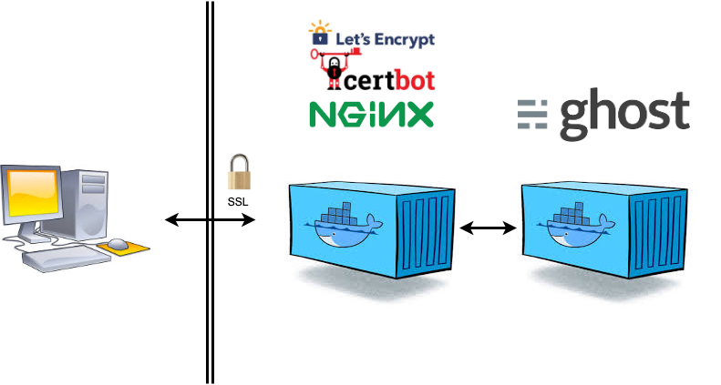

# ghost nginx blog

## 파일 설명
* Dockerfile : nginx 이미지 생성 시 사용
* docker-compose.yml : 다중 컨테이너 설정 파일
* ghostfile/ : ghost 컨테이너의 ghost 파일 디렉토리와 연결(백업 및 편집을 위해 사용)
* nginxfile/ : nginx 컨테이너의 /etc/nginx/nginx.conf 파일과 연결(프록시 설정을 위해 사용)

## 설치
1. Dockerfile의 위치로 이동 후 <code>docker build -t . </code>  명령으로 이미지 생성
2. <code>docker-compose up</code> 명령어로 컨테이너 생성 및 실행
3. <code>docker exec -it nginx-proxy /bin/zsh </code> 명령으로 컨테이너 진입
4. <code>certbot certonly -d [도메인]</code>으로 인증서 생성 후, <code>nginx</code>로 웹서버 시작

